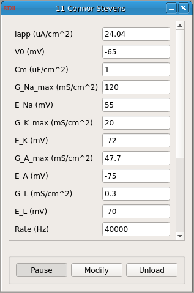

###Connor-Stevens Neuron

**Requirements:** None  
**Limitations:** None  

<!--start-->
The Connor Stevens model neuron is like the Hodgkin-Huxley neuron, but with slightly different kinetics for the fast sodium and potassium delayed-rectifier channels and an additional A-type potassium channel (Dayan and Abbott, Theoretical Neuroscience, Ch. 6). These changes give the Connor Stevens neuron Type I excitability such that it can achieve arbitrarily low spike rates. This feature may make this model more useful for testing custom modules than the Hodgkin-Huxley model neuron.
<!--end-->

####Input Channels
1. input(0) - Iapp : applied current  (A)

####Output Channels
1. output(0) - Vm : membrane voltage (V)

####Parameters
1. V0 - initial membrane voltage (mV)
2. Cm - membrane capacitance (uF/cm^2)
3. G_Na_max - max. Na+ conductance density (mS/cm^2)
4. E_Na - Na+ reversal potential (mV)
5. G_K_max - max. delayed rectifier conductance density (mS/cm^2)
6. E_K - K+ reversal potential (mV)
6. G_A_max - max. transient A-type K+ conductance density (mS/cm^2)
6. E_A - A-type K+ reversal potential (mV) 
7. G_L - leak channel conductance (mS/cm^2)
8. E_L - potential across leak channel (mV)
10. rate - rate of integration (Hz)

####States
1. m - sodium activation
2. h - sodium inactivation
3. n - potassium inactivation
4. a - A-type potassium activation
5. b - A-type potassium inactivation
6. IKA - A-type potassium current
7. Time - time (s)
